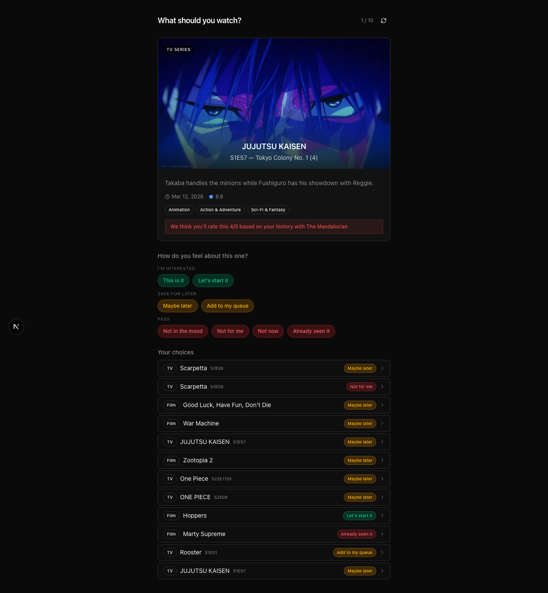
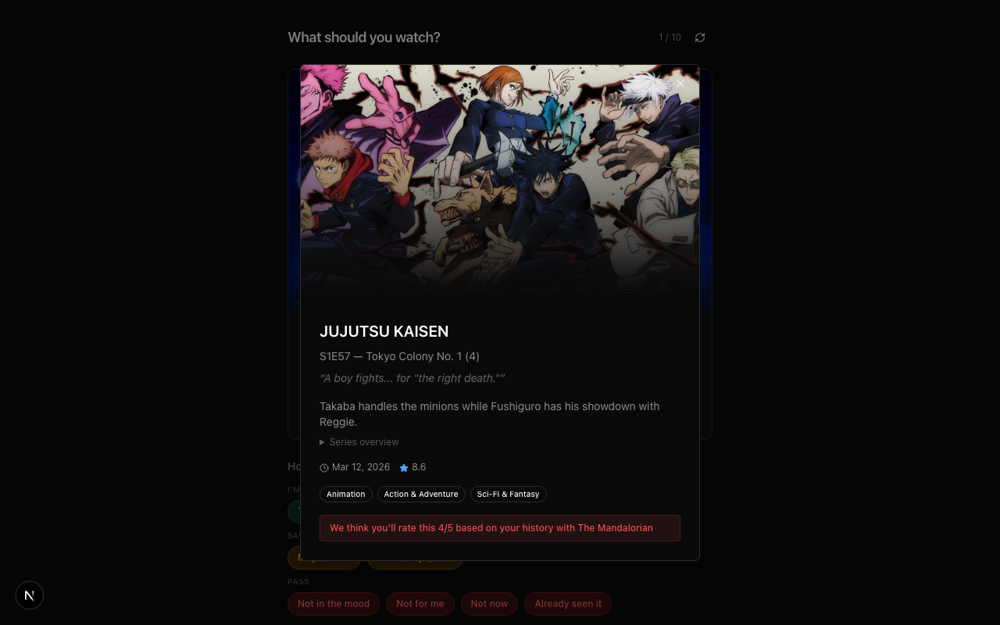
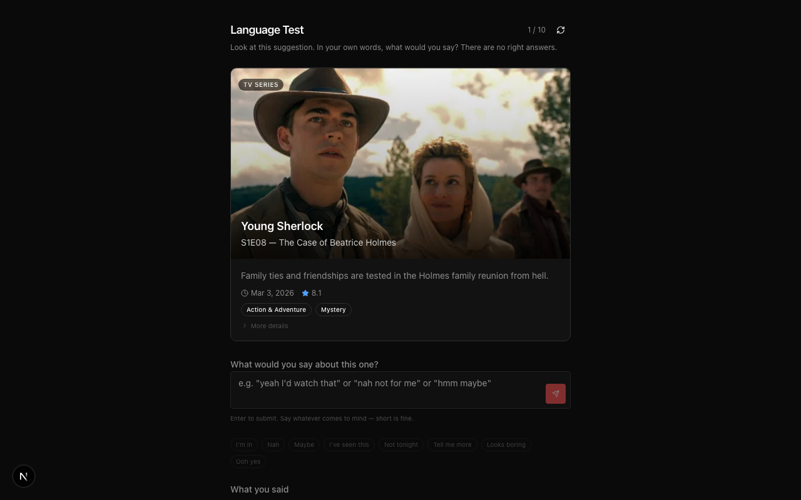
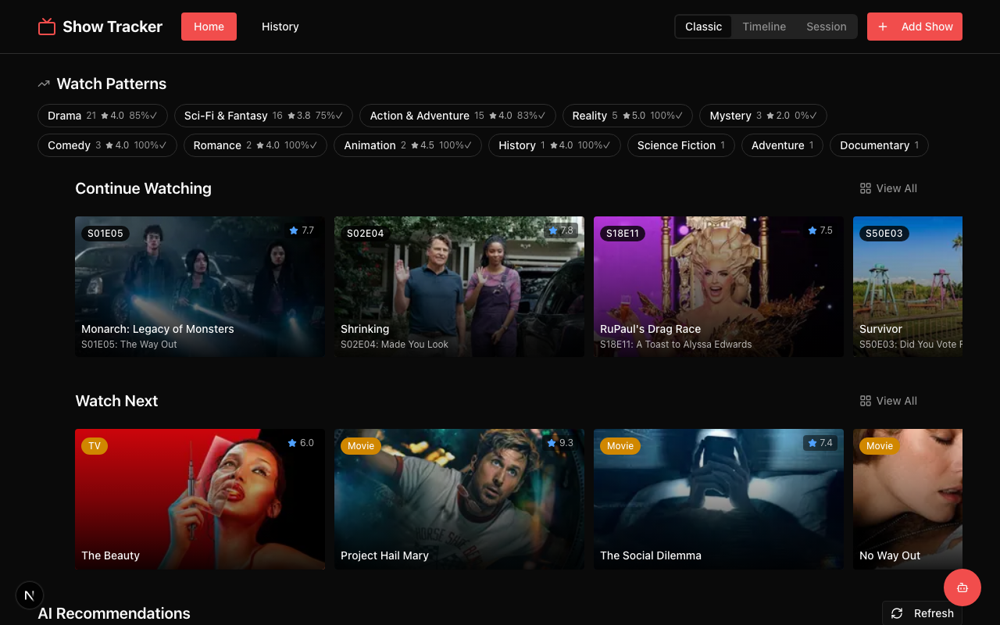
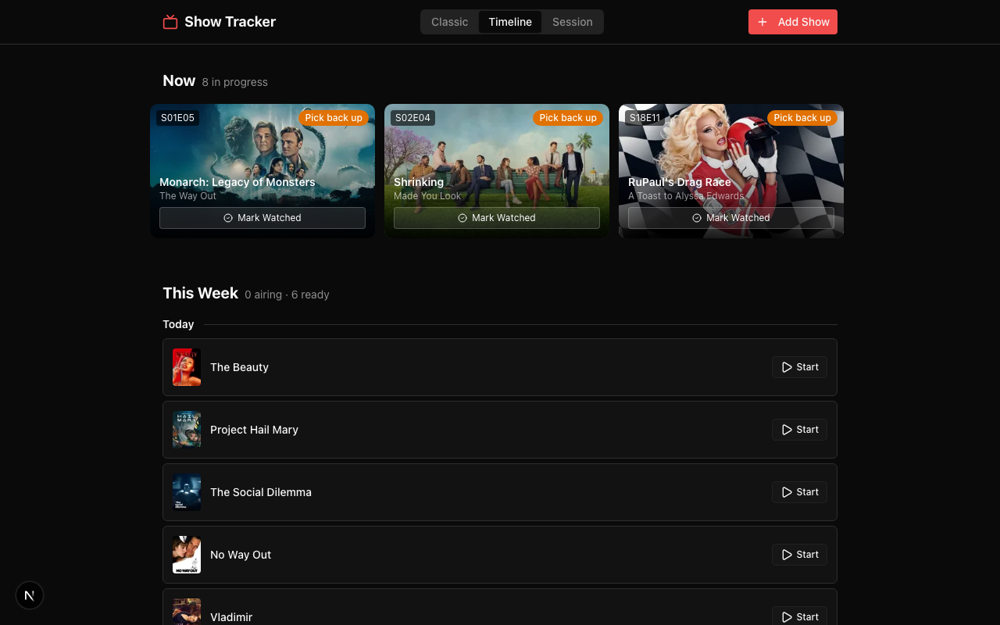
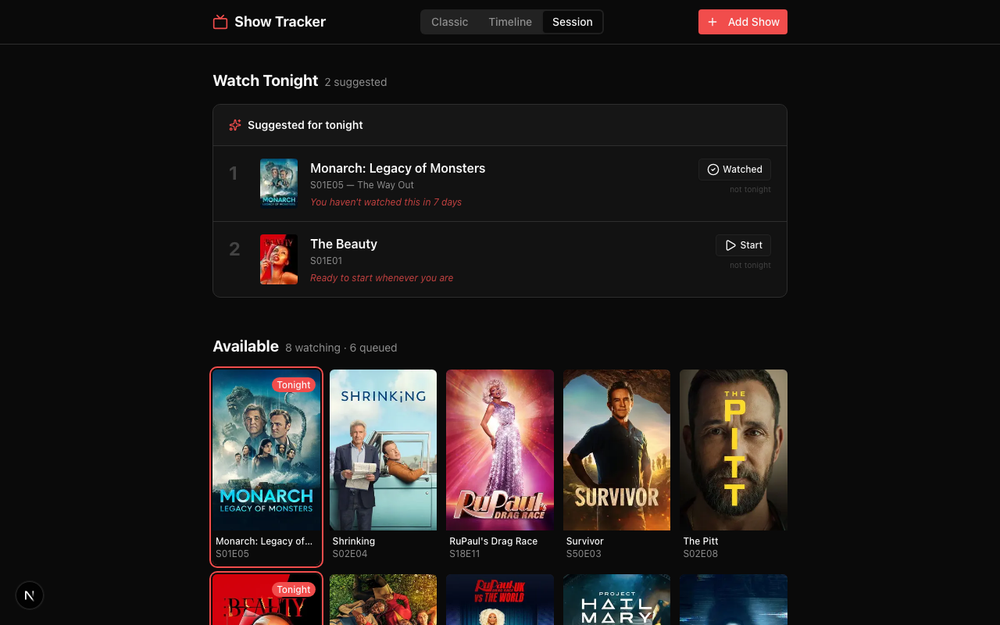

# Marketing & Content Context

_Living document. Updated as the product story evolves._

---

## What This Is

Show Tracker is a proprietary research prototype containing three layers of extractable IP — not a consumer app, but a reusable framework for AI-assisted content discovery and cross-functional collaboration. Built with Next.js, SQLite, and TMDB.

---

## The Three Layers

| Layer | What It Is | Who It's For |
|-------|-----------|--------------|
| **Observation Layer** | Emotional response suggestion loop + behavioral calibration. One card at a time, "How do you feel about this one?" — every response teaches the system. | Streaming platforms, recommendation engines, AI-powered customer experiences |
| **Interaction Pattern Taxonomy** | The pattern/component/experience distinction. Behavioral signal stack. Emotional job framework. A design methodology for turning vague ideas into testable statements. | Design teams, AI prototyping workflows, product organizations |
| **Collaboration Framework** | Living context docs where each cross-functional audience (product, engineering, design, marketing, sales) has a self-contained reference file that their AI agent can read independently. | Product teams, agencies, AI-assisted workflows, cross-functional collaboration |

---

## The Story in One Sentence

Three layers of proprietary IP — observation, taxonomy, collaboration — designed to be extracted, integrated, and scaled across streaming platforms and AI-assisted workflows.

---

## Key Differentiators

- **Behavioral calibration, not collaborative filtering** — the system learns from individual response patterns, not aggregate data. "Not tonight" is a timing signal. "Not for me" is a preference signal. The system learns the difference.
- **Response language validated through natural language clustering** — 30 synthetic responses clustered into 6 intent categories, reduced 8 button labels to 5 based on how users actually speak.
- **Collaboration docs designed for AI agents** — each cross-functional team member (and their AI) reads only their file and has full context. No handoffs. Shared understanding.
- **Proven macro pattern** — same calibration loop as Shadow Health's conversation AI (2016) and Holmusk's clinical workflow. Applied to content discovery.

---

## What NOT to Promise

- Don't say "AI-powered" without qualification. The observation layer captures behavioral signals; the AI integration layer is a separate module.
- Don't promise energy inference. The prototype captures the signals (time of day, dwell time, response patterns) but doesn't yet infer energy level automatically. That's the next development phase.
- Don't use the word "taste." We say "Watch Patterns." The distinction matters — patterns are observable behavior, taste is a judgment.

---

## Screenshots

| Observation card | Preview dialog | Language capture |
|:---:|:---:|:---:|
|  |  |  |

| Classic view | Timeline view | Session view |
|:---:|:---:|:---:|
|  |  |  |

---

## Additional Context

For brand voice guidelines, campaign planning, content creation frameworks, competitive analysis, and performance analytics, see the marketing toolkit in `knowledge-work/marketing-plugin/`.
